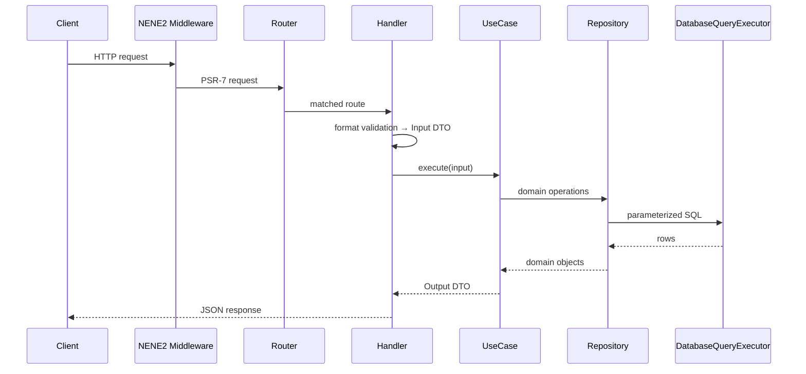

# Backend Standards

NeNe Records backend is a **NENE2 consumer application**: framework runtime, middleware, DI, and database adapters come from [NENE2](https://github.com/hideyukiMORI/NENE2); product logic (entity model, CRUD, schema rules) lives in this repository.

**Status:** Phase 1 (Issue `#1`) implements the first vertical slice — `entity_types`, `entities`, `text_fields` — following these rules from the first commit.

**Framework reference:** `vendor/hideyukimori/nene2/docs/` after `composer install`; sibling checkout at `../NENE2` for IDE jump and upstream PRs.

**Reference implementation:** NENE2 `src/Example/Note/` and `src/Example/Tag/` — same patterns, NeNe Records namespaces and routes.

**Inheritance map:** `docs/inheritance-from-nene2.md`

**Enforcement level:** violations of placement, layering, dependency direction, OpenAPI sync, or security rules **block merge to `main`**. No temporary exceptions without an ADR.

---

## Document map

| Section | Covers |
| --- | --- |
| [Principles](#principles) | Non-negotiable values |
| [NENE2 boundary](#nene2-boundary) | Framework vs application ownership |
| [Repository layout](#repository-layout) | Project tree |
| [Architecture](#architecture) | Request flow, layers, dependencies |
| [Module placement](#module-placement-zero-tolerance) | Domain folders — zero tolerance |
| [Naming](#naming-conventions) | Classes, files, routes, migrations |
| [Handlers](#http-handlers) | Thin HTTP boundary |
| [Use cases](#use-cases) | Application logic |
| [Repositories](#repositories-and-database) | Persistence |
| [DI and routing](#dependency-injection-and-routing) | Wiring |
| [Validation](#validation-layers) | Where rules live |
| [Errors](#errors-and-problem-details) | RFC 9457 |
| [OpenAPI](#openapi-and-mcp) | Contract-first |
| [Testing](#testing) | Pyramid and placement |
| [Security](#security) | API boundary |
| [CI](#commands-and-ci) | Quality gates |

---

## Principles

| Principle | Meaning |
| --- | --- |
| **API first** | OpenAPI describes public behavior; runtime must match. |
| **Domain-grouped modules** | Code grouped by **aggregate** (`EntityType/`, `Entity/`), not by technical layer (`Controllers/`, `Repositories/`). |
| **Thin HTTP** | Handlers parse/validate format → DTO → use case → JSON response. No business rules in handlers. |
| **Use case centric** | Business invariants live in use cases; one `execute()` per operation. |
| **Interface at boundaries** | Repositories and use cases exposed as interfaces; wired explicitly in service providers. |
| **No raw persistence in domain** | Use cases never touch PDO; SQL only in `Pdo*Repository` adapters via NENE2 executors. |
| **Typed boundaries** | Readonly DTOs, domain objects, enums — not unstructured arrays across layers. |
| **Fixed placement** | Handlers, use cases, repositories, and tests live in mandated paths — **violations block merge**. |
| **Test by layer** | In-memory repos for use cases; SQLite for repositories; HTTP + OpenAPI for contracts. |
| **Secure by default** | Fail closed on auth; no secrets in repo; errors do not leak internals. |

---

## NENE2 boundary

| Owns | Layer |
| --- | --- |
| **NENE2** (`vendor/…/nene2`) | HTTP runtime, Router, middleware pipeline, DI container builder, PDO adapters, Problem Details factory, OpenAPI tooling, MCP plumbing |
| **NeNe Records** (`src/`) | Entity platform domains, migrations for product tables, OpenAPI paths for product API, application service providers, contract tests for product routes |
| **Not shipped** | NENE2 `src/Example/Note|Tag` — reference only; do not expose `/examples/notes` in production NeNe Records |

Consumer wiring replaces Example providers with NeNe Records providers. See NENE2 `docs/development/client-project-start.md`.

---

## Repository layout

```text
nene-records/
  composer.json                 # require hideyukimori/nene2; PSR-4 NeNeRecords\ → src/
  phinx.php                     # reads NENE2 ConfigLoader / DatabaseConfig
  phpunit.xml.dist
  phpstan.neon.dist
  .php-cs-fixer.php
  public_html/
    index.php                   # front controller → project container factory
    openapi.php                 # serves docs/openapi/openapi.yaml
  src/
    EntityType/                 # domain module (Issue #1)
    Entity/
    TextField/
    ApplicationServiceProvider.php
    Http/
      RuntimeContainerFactory.php   # project container; registers app providers
  tests/
    EntityType/
    Entity/
    TextField/
    OpenApi/                    # contract tests vs docs/openapi/openapi.yaml
    Database/                   # optional shared DB test helpers
  database/
    migrations/
    schema/                     # SQL snapshots per table
  docs/
    openapi/openapi.yaml        # public contract source of truth
    mcp/tools.json              # when MCP tools exist
  tools/                        # optional; or reuse NENE2 validate scripts via composer
```

Do **not** mirror NENE2 framework directories inside `src/` (`Middleware/`, `Routing/`, …) — consume them from the package.

---

## Architecture

### Request flow



### Layer dependency graph

```text
Handler → UseCaseInterface → RepositoryInterface → PdoRepository → DatabaseQueryExecutorInterface (NENE2)
         ↓
    Input/Output DTOs, Domain entity, Domain exceptions
```

**Hard rules:**

- **Downward only** — repositories never call use cases; handlers never call repositories directly.
- **No sideways** — `EntityType/` must not import `Entity/` internals; cross-aggregate orchestration uses application-level use cases or explicit ADR.
- **Framework up** — application code imports `Nene2\…` infrastructure; NENE2 never imports `NeNeRecords\…`.

### Validation split

| Layer | Validates |
| --- | --- |
| **Middleware** | Auth, size limits, CORS, rate limits (NENE2) |
| **Handler** | JSON shape, required fields, formats → `ValidationException` |
| **Use case** | Business invariants: existence, uniqueness, state, soft-delete rules, schema registry (future) |
| **Repository** | Nothing — persists and retrieves only |

---

## Module placement (zero tolerance)

Each **aggregate or API resource** gets one folder under `src/` in **PascalCase** matching the domain name (`EntityType`, `Entity`, `TextField`).

**Do not** create `src/UseCases/`, `src/Handlers/`, or `src/Repositories/` layer roots.

### Canonical domain tree

```text
src/EntityType/
  EntityType.php                      # domain entity (final readonly) — optional until needed
  EntityTypeNotFoundException.php
  CreateEntityTypeInput.php
  CreateEntityTypeOutput.php
  ListEntityTypesInput.php
  ListEntityTypesOutput.php
  ListEntityTypeItem.php
  GetEntityTypeByIdInput.php          # when input non-trivial; omit for id-only gets
  GetEntityTypeByIdOutput.php
  UpdateEntityTypeInput.php
  UpdateEntityTypeOutput.php
  DeleteEntityTypeInput.php
  DeleteEntityTypeOutput.php          # or void pattern via empty output DTO
  CreateEntityTypeUseCaseInterface.php
  CreateEntityTypeUseCase.php
  GetEntityTypeByIdUseCaseInterface.php
  GetEntityTypeByIdUseCase.php
  ListEntityTypesUseCaseInterface.php
  ListEntityTypesUseCase.php
  UpdateEntityTypeUseCaseInterface.php
  UpdateEntityTypeUseCase.php
  DeleteEntityTypeUseCaseInterface.php
  DeleteEntityTypeUseCase.php
  EntityTypeRepositoryInterface.php
  PdoEntityTypeRepository.php
  CreateEntityTypeHandler.php
  GetEntityTypeByIdHandler.php
  ListEntityTypesHandler.php
  UpdateEntityTypeHandler.php
  DeleteEntityTypeHandler.php
  EntityTypeNotFoundExceptionHandler.php
  EntityTypeRouteRegistrar.php
  EntityTypeServiceProvider.php
```

List operations use `List{Entity}Item` inside `List{Entity}sOutput` — same as NENE2 Note pattern.

### Placement matrix (mandatory)

| Artifact | Required path | May depend on |
| --- | --- | --- |
| Domain entity | `src/{Domain}/{Entity}.php` | same domain value types only |
| Domain exception | `src/{Domain}/{Entity}NotFoundException.php` | — |
| Input DTO | `src/{Domain}/{Operation}Input.php` | primitives, enums, ids from same domain |
| Output DTO | `src/{Domain}/{Operation}Output.php` | same |
| List item DTO | `src/{Domain}/List{Entity}Item.php` | same |
| Use case interface | `src/{Domain}/{Operation}UseCaseInterface.php` | Input/Output DTOs |
| Use case impl | `src/{Domain}/{Operation}UseCase.php` | repository interface, domain |
| Repository interface | `src/{Domain}/{Entity}RepositoryInterface.php` | domain entity |
| PDO repository | `src/{Domain}/Pdo{Entity}Repository.php` | `DatabaseQueryExecutorInterface`, domain |
| HTTP handler | `src/{Domain}/{Operation}Handler.php` | use case interface, NENE2 HTTP helpers |
| Exception → HTTP | `src/{Domain}/{Exception}Handler.php` | NENE2 Problem Details factory |
| Route registrar | `src/{Domain}/{Entity}RouteRegistrar.php` | handlers only |
| Service provider | `src/{Domain}/{Entity}ServiceProvider.php` | NENE2 DI interfaces |
| Migrations | `database/migrations/` | Phinx API only |
| Schema snapshot | `database/schema/{table}.sql` | matches migration end state |
| OpenAPI | `docs/openapi/openapi.yaml` | — |
| Use case unit test | `tests/{Domain}/{Operation}UseCaseTest.php` | in-memory repository double |
| Repository test | `tests/{Domain}/Pdo{Entity}RepositoryTest.php` | SQLite `:memory:` |
| HTTP test | `tests/{Domain}/{Entity}HttpTest.php` | wired handlers or full runtime |
| In-memory double | `tests/{Domain}/InMemory{Entity}Repository.php` | implements production interface |

### Cross-domain rules

- **No imports of another domain's `Pdo*Repository`, handlers, or internal DTOs.**
- Shared kernel (future): `src/Shared/` with ADR — not a dumping ground for convenience helpers.
- **ApplicationServiceProvider** aggregates domain providers and exposes route registrar list — it does not contain business logic.

### Forbidden placements (automatic PR reject)

- Business logic in handlers beyond format validation
- SQL outside `Pdo*Repository.php`
- PDO / `DatabaseQueryExecutorInterface` in use cases or handlers
- Use cases accepting `ServerRequestInterface` or raw request body arrays
- Domain code under `vendor/` or copied NENE2 framework trees in `src/`
- Public routes without OpenAPI path (when endpoint is shipped)
- Layer-grouped directories (`src/Controllers/`, `src/UseCases/`)
- Generic `src/Util/` with domain rules

---

## Naming conventions

| Artifact | Pattern | Example |
| --- | --- | --- |
| Namespace | `NeNeRecords\{Domain}\` | `NeNeRecords\EntityType\CreateEntityTypeHandler` |
| Test namespace | `NeNeRecords\Tests\{Domain}\` | `NeNeRecords\Tests\EntityType\CreateEntityTypeUseCaseTest` |
| Use case | `{Verb}{Entity}UseCase` + `Interface` | `GetEntityTypeByIdUseCaseInterface` |
| Handler | `{Verb}{Entity}Handler` or `List{Entity}sHandler` | `ListEntityTypesHandler` |
| Input / Output | `{Operation}Input` / `{Operation}Output` | `UpdateEntityTypeInput` |
| Repository IF | `{Entity}RepositoryInterface` | `EntityTypeRepositoryInterface` |
| PDO adapter | `Pdo{Entity}Repository` | `PdoEntityTypeRepository` |
| Route registrar | `{Entity}RouteRegistrar` | `EntityTypeRouteRegistrar` |
| Service provider | `{Entity}ServiceProvider` | `EntityTypeServiceProvider` |
| Migration file | `YYYYMMDDHHMMSS_snake_description.php` | `20260524000000_create_entity_types_table.php` |
| Migration class | PascalCase matching purpose | `CreateEntityTypesTable` |
| API path | plural kebab or snake per OpenAPI | `/entity-types`, `/entity-types/{id}` |
| `operationId` | camelCase verb + entity | `listEntityTypes`, `createEntityType` |

### PHP defaults (inherited from NENE2)

- `declare(strict_types=1);` on **every** PHP file
- PHP `>=8.4.1 <9.0`
- `final readonly class` for DTOs, handlers, domain entities, service providers where applicable
- PSR-12 via PHP-CS-Fixer
- Constructor injection only — **no service locator** in domain code
- One class per file; filename matches class name

---

## HTTP handlers

Handlers are the **only** layer that touches PSR-7.

### Responsibilities

1. Parse JSON body (`JsonRequestBodyParser`) or read path params from `Router::PARAMETERS_ATTRIBUTE`
2. **Format validation** → collect `ValidationError[]` → throw `ValidationException`
3. Map to Input DTO
4. Call `$useCase->execute($input)`
5. Map Output DTO to JSON via `JsonResponseFactory`
6. Set correct status (`200`, `201` + `Location`, `204`)

### Forbidden in handlers

- Repository calls
- Business rules (uniqueness, soft-delete policy, schema invariants)
- Direct SQL or transaction control
- Reading path params via `$request->getAttribute('id')` — use `Router::PARAMETERS_ATTRIBUTE` (NENE2 router stores params as a named array)

Reference: `../NENE2/src/Example/Note/CreateNoteHandler.php`

---

## Use cases

One application operation = one use case interface with single method:

```php
interface CreateEntityTypeUseCaseInterface
{
    public function execute(CreateEntityTypeInput $input): CreateEntityTypeOutput;
}
```

### Rules

- `final readonly class` implementation
- Constructor-injected repository **interfaces** only
- Input carries format-validated data; use case enforces **business invariants**
- Throw domain exceptions (`EntityTypeNotFoundException`) for caller-actionable failures
- Return typed Output DTO — callers must not re-query repository for the same data
- **No** HTTP, **no** PDO, **no** container, **no** `$_ENV`

### NeNe Records domain rules (Issue #1+)

- **Soft delete:** list/get default excludes `is_deleted = true` unless admin API documented otherwise
- **Typed fields:** text values in `text_fields` — not generic untyped meta blobs
- **Schema registry (future):** field definition validation on write happens in use cases, not handlers alone

Reference: `../NENE2/docs/development/domain-layer.md`

---

## Repositories and database

### Access pattern

- Inject `DatabaseQueryExecutorInterface` (NENE2) into `Pdo*Repository` only
- **Parameterized queries only** — no string concatenation of user input
- Map rows to domain objects inside repository — return domain types, not `array` rows to use cases
- Transactions via `DatabaseTransactionManagerInterface` when use case spans multiple writes — coordinate at use case or dedicated application service with ADR

### Migrations (Phinx)

- Config: `phinx.php` at project root (NENE2 pattern)
- Paths: `database/migrations/`, `database/seeds/`
- Every new table: migration + snapshot in `database/schema/{table}.sql`
- Reversible migrations or documented rollback strategy
- Consistent soft-delete columns: `is_deleted` (bool), `deleted_at` (nullable datetime) where applicable
- Indexes on foreign keys and common filters (`entity_type_id`, etc.)

### Issue #1 tables

| Table | Purpose |
| --- | --- |
| `entity_types` | name, slug |
| `entities` | `entity_type_id`, soft delete |
| `text_fields` | `entity_id`, key, value, soft delete |

Reference: NENE2 `docs/development/database-migrations.md`, `docs/development/test-database-strategy.md`

---

## Dependency injection and routing

### Service providers

Each domain implements `ServiceProviderInterface` (NENE2):

- Bind `{Entity}RepositoryInterface` → `Pdo{Entity}Repository`
- Bind each `{Operation}UseCaseInterface` → implementation
- Bind each `{Operation}Handler`
- Bind `{Entity}NotFoundExceptionHandler`
- Register string key `'nene-records.route_registrar.{entity}'` → `{Entity}RouteRegistrar`

Wire with **explicit factory closures** and runtime `instanceof` checks — same as NENE2 Note provider. **No autowiring.**

`ApplicationServiceProvider` registers all domain providers and collects route registrars for `RuntimeApplicationFactory`.

### Project container

`src/Http/RuntimeContainerFactory.php`:

1. Creates NENE2 `ContainerBuilder` with project root
2. Adds `RuntimeServiceProvider` (NENE2)
3. Adds `ApplicationServiceProvider` (NeNe Records) — **not** NENE2 Example providers in production
4. Builds PSR-11 container

`public_html/index.php` — front controller only; no business logic.

### Routing

- Domain `{Entity}RouteRegistrar` receives `Router` and registers REST routes
- Path prefix for product API: **`/api/v1/`** (ADR may adjust — use consistently once chosen)
- Handlers resolved from container in registrar constructor — registrars do not contain request logic

Reference: `../NENE2/src/Example/Note/NoteRouteRegistrar.php`, `docs/development/http-runtime.md`

---

## Validation layers

| Concern | Where | Mechanism |
| --- | --- | --- |
| Missing JSON field | Handler | `ValidationError` + `ValidationException` |
| Invalid slug format | Handler | format rule |
| Duplicate slug | Use case | repository check → domain exception or conflict Problem Details |
| Referenced entity missing | Use case | `NotFoundException` |
| Field key not in schema | Use case | future schema registry |

Public validation metadata and Problem Details titles: **English**.

Reference: NENE2 `docs/development/request-validation.md`

---

## Errors and Problem Details

- All public JSON errors: **RFC 9457** via NENE2 `ProblemDetailsResponseFactory`
- Application error `type`: `https://nene-records.dev/problems/{problem-name}`
- Validation failures: `validation-failed` with structured `errors` array
- Register domain exception handlers in domain service provider
- **Never** expose stack traces, SQL, file paths, or secrets in responses
- Log details server-side (NENE2 PSR-3 + request ID)

Reference: NENE2 `docs/development/api-error-responses.md`

---

## OpenAPI and MCP

### OpenAPI

- **Source of truth:** `docs/openapi/openapi.yaml` (OpenAPI 3.1.0)
- Every shipped JSON endpoint includes:
  - stable `operationId`
  - success schema + realistic example
  - Problem Details responses (`401`, `404`, `422`, `500`, … as applicable)
- Served via `public_html/openapi.php`
- Validate: `composer openapi`

### Endpoint completion checklist

An endpoint is **not done** until:

1. Route + handler + use case + repository (if persistent)
2. OpenAPI path updated
3. Unit test (use case) + integration test (repository and/or HTTP)
4. Contract test entry if part of public surface
5. Migration + schema snapshot when table changes

Reference: NENE2 `docs/development/endpoint-scaffold.md`

### MCP

- Catalog: `docs/mcp/tools.json`
- Each tool maps to OpenAPI `method` + `path` + `operationId`
- Validate: `composer mcp`
- MCP never accesses database directly — HTTP only

---

## Testing

### Pyramid

| Level | Tool | Scope | Required when |
| --- | --- | --- | --- |
| **Use case unit** | PHPUnit | `{Operation}UseCaseTest` with `InMemory*Repository` | Every use case |
| **Repository** | PHPUnit + SQLite `:memory:` | `Pdo*RepositoryTest`; schema in `setUp()` | Every PDO repository |
| **HTTP** | PHPUnit + PSR-7 | `{Entity}HttpTest` or runtime factory | Every handler group |
| **OpenAPI contract** | PHPUnit | `tests/OpenApi/` vs YAML examples | Public JSON endpoints |
| **Static analysis** | PHPStan level 8 | `src/` | All PRs |

### Test placement

| Artifact | Location |
| --- | --- |
| In-memory repository | `tests/{Domain}/InMemory{Entity}Repository.php` |
| Use case tests | `tests/{Domain}/{Operation}UseCaseTest.php` |
| Repository tests | `tests/{Domain}/Pdo{Entity}RepositoryTest.php` |
| HTTP tests | `tests/{Domain}/{Entity}HttpTest.php` |
| Contract tests | `tests/OpenApi/` |

### Rules

- Use cases tested **without** database when possible
- Repository tests use SQLite — schema created per test class; do not depend on migration runner in unit tests
- No network in unit tests
- Test doubles implement **production interfaces** from `src/`
- Bug fixes include regression test unless Issue waives

Reference: NENE2 `docs/development/test-database-strategy.md`, `tests/Example/Note/`

---

## Security

| Topic | Rule |
| --- | --- |
| **Secrets** | Never in repo; `.env` gitignored; `.env.example` only non-secret keys |
| **Auth** | NENE2 middleware (Bearer, API key, composite) — handlers assume auth already enforced when route requires it |
| **Input** | Validate at handler; never trust client for schema authority |
| **SQL** | Parameterized only; no dynamic identifier injection without allowlist |
| **Errors** | Fail closed; no internal detail in JSON |
| **Dependencies** | `composer audit` in CI; block high/critical on `main` |
| **Debug** | `APP_DEBUG` controls verbosity — never enable in production deploy docs by default |

Reference: NENE2 `docs/development/middleware-security.md`, `authentication-boundary.md`

---

## Commands and CI

Once `composer.json` exists:

```bash
composer install
composer check          # test + phpstan + cs + openapi + mcp (+ version when applicable)
composer test
composer analyse
composer cs
composer openapi
composer migrations:migrate
```

### Required before merge (API PRs)

1. `composer check` green
2. OpenAPI updated for changed endpoints
3. Tests for touched use cases and repositories
4. `git diff --check` clean for doc-only; CS-Fixer clean for PHP

### PHPStan

- Level **8** minimum on `src/`
- No `@phpstan-ignore` without Issue/ADR comment

### PHP-CS-Fixer

- PSR-12 based NENE2 config
- `composer cs` must pass — no manual style arguments in PR

---

## Admin vs API consumers

The JSON API is the only persistence boundary for admin frontend, consumer views, and MCP. No special "admin bypass" repositories — authorization differs by middleware/policy, not duplicate data paths.

---

## Non-goals

- Forking NENE2 framework code into `src/`
- Laravel/Symfony-style full stack in this repo
- WordPress compatibility
- Direct DB access from MCP or frontend
- Generic EAV blob storage for all field types (Issue #1 uses typed `text_fields`)

---

## Related documents

- Summary index: `docs/development/coding-standards.md`
- Frontend: `docs/development/frontend-standards.md`
- Self-review: `docs/review/backend-api.md`, `database.md`, `openapi-contract.md`
- NENE2 domain layer: `../NENE2/docs/development/domain-layer.md`
- NENE2 client start: `../NENE2/docs/development/client-project-start.md`
- Product: `docs/explanation/product-vision.md`
- Issue #1: MVP entity CRUD vertical slice
