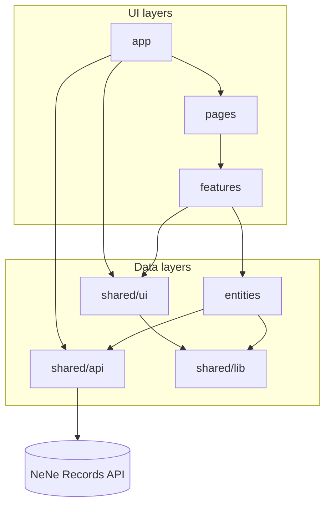

# Frontend Standards

NeNe Records admin and consumer frontends are **React + TypeScript** clients of the JSON API. They are not the source of truth for schema, validation, or persistence.

**Status:** policy only — **Phase 4** implementation. Issue `#1` (Phase 1 MVP) is API-only; do not add `frontend/` until the OpenAPI contract for entity CRUD is stable enough to build against.

**Framework baseline:** [NENE2 frontend integration](https://github.com/hideyukiMORI/NENE2/blob/main/docs/development/frontend-integration.md) — directory layout, npm, lockfile, build output, and dev proxy.

**Inheritance map:** `docs/inheritance-from-nene2.md`

**Enforcement level:** violations of placement, dependency direction, data flow, security, or testing rules in this document **block merge to `main`**. No temporary exceptions without an ADR.

---

## Document map

| Section | Covers |
| --- | --- |
| [Principles](#principles) | Non-negotiable values |
| [Architecture](#architecture) | Layers, dependency graph, design boundaries |
| [Repository layout](#repository-layout) | Top-level tree |
| [Type and module placement](#type-and-module-placement-zero-tolerance) | Models, enums, API types — zero tolerance |
| [Data flow](#data-flow) | Read/write paths, cache, URL state |
| [Design patterns](#design-patterns) | Mandatory React/TS patterns and forbidden anti-patterns |
| [TypeScript](#typescript-strictness) | Compiler and type rules |
| [Components](#component-conventions) | UI structure and styling |
| [API access](#api-and-data-access) | HTTP, TanStack Query, errors |
| [State](#state-management) | What state lives where |
| [Security](#security) | Client-side security baseline |
| [Testing](#testing) | Pyramid, tools, placement, required coverage |
| [A11y / perf / observability](#accessibility) | Quality bars beyond correctness |
| [CI](#commands-and-ci) | Commands and automated gates |

---

## Principles

| Principle | Meaning |
| --- | --- |
| **API first** | OpenAPI is the contract; UI reflects API types and errors, never replaces validation. |
| **Unidirectional flow** | Data flows **down** (API → entity → feature → UI); events flow **up** (UI → feature hook → mutation → API). No sideways shortcuts. |
| **Strict TypeScript** | `strict` mode and additional compiler guards; no untyped escape hatches by default. |
| **Fixed placement** | Models, enums, hooks, and tests live in mandated paths — **placement violations block merge**. |
| **Explicit dependencies** | Import graph encodes architecture; ESLint enforces it. |
| **Loose coupling** | Layers communicate through public surfaces (`index.ts`, props, hooks) — not internals. |
| **Secure by default** | Fail closed on auth errors; minimal trust of client input and third-party markup. |
| **Test by behavior** | Tests assert user-observable outcomes; MSW mirrors OpenAPI at boundaries. |
| **Replaceable** | Admin SPA and consumer views swap independently when contracts stay stable. |

---

## When to implement

| Phase | Frontend work |
| --- | --- |
| Phase 1 (`#1`) | **None** — PHP API, migrations, OpenAPI, PHPUnit only |
| Phase 2–3 | Optional read-only prototypes only if explicitly tracked by an Issue |
| Phase 4 | Admin React app — entity type editor, record CRUD screens |
| Phase 6 | Consumer views — replaceable presentation over the same API |

Conventions apply **now** to frontend policy PRs. Application code waits until Phase 4 unless an Issue says otherwise.

---

## Stack (NeNe Records default)

Adopt current stable majors at scaffold time; keep them current with Dependabot or Renovate.

| Layer | Choice | Notes |
| --- | --- | --- |
| UI | **React** (latest stable major) | Function components and hooks only — no class components |
| Language | **TypeScript** (latest stable major) | All app source in `.ts` / `.tsx` |
| Bundler | **Vite** | Dev server + production build |
| Package manager | **npm** | Commit `frontend/package-lock.json`; CI uses `npm ci` |
| Node.js | **Active LTS** | `engines` + `packageManager` in `frontend/package.json` |
| Routing | **React Router** | Data APIs / loaders optional; URL is shareable state |
| Server state | **TanStack Query v5** | Queries, mutations, cache, invalidation |
| Forms | **React Hook Form** + **Zod** | Client UX validation only — API remains authoritative |
| Lint | **ESLint** flat config: `typescript-eslint` strict-type-checked, `react-hooks`, `jsx-a11y`, `import/no-restricted-paths` or `eslint-plugin-boundaries` | `--max-warnings 0` |
| Format | **Prettier** | Single formatter |
| Unit / integration | **Vitest** + **Testing Library** + **MSW** | jsdom environment |
| E2E | **Playwright** | Critical admin flows after Phase 4 stabilizes |
| Dead code | **knip** (recommended) | Fail CI on unused exports in `entities/` and `features/` |

Alternate UI frameworks, state libraries, or package managers require an ADR.

---

## Architecture

NeNe Records frontend uses a **strict layered architecture** adjacent to [Feature-Sliced Design](https://feature-sliced.design/): `app → pages → features → entities → shared`.

It is **not** a generic FSD repo — entity modules and API boundaries are **NeNe-specific** and stricter than generic FSD guidance.

### Layer responsibilities

| Layer | Owns | Must not own |
| --- | --- | --- |
| **`shared/`** | Transport, design tokens, pure utils, env | Routes, features, resource models, business workflows |
| **`entities/`** | One API resource: DTO mapping, query keys, TanStack hooks | JSX, cross-resource orchestration, feature copy |
| **`features/`** | User workflows composing entities + UI | Raw HTTP, DTO types, direct TanStack key strings |
| **`pages/`** | Route wiring, lazy loading, layout slots | Business rules, API calls |
| **`app/`** | Providers, router, global error boundary, auth gate shell | Feature-specific screens |

### Dependency graph



**Hard rule:** no arrow may point **upward** (e.g. `entities → features`, `shared → entities`).

### Import matrix (mandatory)

| From ↓ / To → | `shared/ui` | `shared/api` | `shared/lib` | `entities/*` | `features/*` | `pages/*` | `app/*` |
| --- | --- | --- | --- | --- | --- | --- | --- |
| `shared/ui` | ✓ internal | ✗ | ✓ | ✗ | ✗ | ✗ | ✗ |
| `shared/api` | ✗ | ✓ internal | ✓ | ✗ | ✗ | ✗ | ✗ |
| `shared/lib` | ✗ | ✗ | ✓ internal | ✗ | ✗ | ✗ | ✗ |
| `entities/{r}` | ✗ | ✓ client only | ✓ | ✗ sibling | ✗ | ✗ | ✗ |
| `features/{f}` | ✓ | ✗ | ✓ | ✓ via `index.ts` | ✗ cross-feature | ✗ | ✗ |
| `pages/` | ✓ | ✗ | ✓ | ✗ direct | ✓ via `index.ts` | ✗ | ✗ |
| `app/` | ✓ | ✓ providers | ✓ | ✗ | ✗ | ✓ | ✓ internal |

Cross-feature sharing: extract to `entities/` (if resource-level) or `shared/` (if generic with ADR) — **never** import `features/foo` from `features/bar`.

### Public surfaces

Every `entities/{resource}/` and `features/{feature}/` folder exposes **`index.ts` only** to upper layers. Internals (`mapper.ts`, `api-types.ts`, `ui/*.tsx`) are private to the slice.

---

## Repository layout

Follow NENE2 placement: source under `frontend/`, built assets under `public_html/assets/` when integrated.

```text
frontend/
  package.json
  package-lock.json
  tsconfig.json
  tsconfig.app.json
  vite.config.ts
  eslint.config.js
  vitest.config.ts
  README.md                   # links to this document
  src/
    app/
      providers.tsx           # QueryClientProvider, Router, theme
      router.tsx
      root-error-boundary.tsx
      auth-gate.tsx           # fail-closed session check
    pages/
      entity-types/
        EntityTypesPage.tsx
    features/
    entities/
    shared/
  tests/
    setup/                    # vitest setup, MSW server bootstrap
    msw/                      # shared MSW handlers (or per-entity __msw__)
    factories/                # test data builders (models, not raw DTOs)
    render/                   # renderWithProviders(), createTestQueryClient()
```

**Admin** and **consumer** may later split to `frontend/admin/` and `frontend/consumer/` with duplicated `shared/` extracted to `packages/shared/` — requires ADR.

---

## Type and module placement (zero tolerance)

**Placement violations are never accepted on `main`.**

Enforcement:

- ESLint `import/no-restricted-paths` / `eslint-plugin-boundaries` — **`npm run lint` fails**
- Reviewers reject structural drift; no “fix later” PRs

### Canonical entity tree

Each API resource → one `entities/{resource}/` folder (**kebab-case**, matches OpenAPI tag).

```text
entities/entity-type/
  index.ts              # ONLY public import surface
  ids.ts                # branded IDs
  enum.ts               # resource-scoped enums (optional)
  api-types.ts          # DTOs pre-codegen; aliases post-codegen
  model.ts              # UI read models
  mapper.ts             # DTO ↔ model (pure)
  query-keys.ts         # TanStack key factory
  queries.ts            # useQuery hooks
  mutations.ts          # useMutation hooks
  mapper.test.ts
  query-keys.test.ts    # when non-trivial
```

### Placement matrix

| Artifact | Required path |
| --- | --- |
| OpenAPI-generated types | `shared/api/generated/` |
| Hand-written API DTOs | `entities/{resource}/api-types.ts` |
| Branded IDs | `entities/{resource}/ids.ts` |
| Enums | `entities/{resource}/enum.ts` or `shared/lib/enums/{name}.ts` (ADR) |
| UI models | `entities/{resource}/model.ts` |
| Mappers | `entities/{resource}/mapper.ts` |
| Query keys | `entities/{resource}/query-keys.ts` |
| `useQuery` | `entities/{resource}/queries.ts` |
| `useMutation` | `entities/{resource}/mutations.ts` |
| HTTP transport | `shared/api/client.ts` |
| Problem Details | `shared/api/errors.ts` |
| Cross-resource API helpers | `shared/api/types/` |
| Component props | same `.tsx` file as component |
| Feature orchestration hooks | `features/{feature}/hooks/` |
| Test render helpers | `tests/render/` |
| MSW handlers | `tests/msw/{resource}.ts` or `entities/{resource}/__msw__/handlers.ts` |
| Test factories | `tests/factories/{resource}.ts` |

### Import surface rules

- Upper layers import entities **only** via `entities/{resource}/index.ts`.
- **`features/` must not import** `shared/api/generated/` or `entities/*/api-types.ts`.
- **`shared/ui/` must not import** `entities/`, `features/`, or generated types.
- **Sibling entities never import each other.**
- **`index.ts` does not re-export** `api-types`, `mapper`, or generated DTOs.

Example public surface:

```typescript
export type { EntityTypeId } from "./ids";
export type { EntityType } from "./model";
export { EntityTypeStatus } from "./enum";
export { entityTypeKeys } from "./query-keys";
export { useEntityType, useEntityTypeList } from "./queries";
export { useCreateEntityType, useUpdateEntityType, useDeleteEntityType } from "./mutations";
```

### Forbidden placements (automatic reject)

- DTOs / API shapes in `features/`, `pages/`, `shared/ui/`, or `.tsx` (except `*Props`)
- Models, enums, mappers outside `entities/{resource}/`
- TanStack logic outside `query-keys.ts` / `queries.ts` / `mutations.ts`
- `fetch` outside `shared/api/client.ts`
- `shared/api/generated/` imported from any `.tsx`
- Deep entity imports from features
- Root-level `src/types/`, `src/utils/` type dumps

---

## Data flow

### Read path (server → UI)

```text
API JSON
  → shared/api/client.ts          (transport, auth headers, status parse)
  → entities/{r}/api-types.ts     (wire shape)
  → entities/{r}/mapper.ts        (map to model)
  → entities/{r}/queries.ts       (TanStack Query cache)
  → features/{f}/hooks/*.ts         (compose queries, derive view state)
  → features/{f}/ui/*.tsx           (render props)
```

Rules:

- **Mappers run inside entity hooks**, not in components.
- Components receive **`model` types** and plain callbacks — never raw `Response`, never DTOs.
- List screens use **stable query keys** from `query-keys.ts` only.

### Write path (UI → server)

```text
UI event
  → features/{f}/hooks              (or entity mutation hook directly)
  → entities/{r}/mutations.ts       (useMutation)
  → shared/api/client.ts
  → API
  → onSuccess: invalidate query-keys  (explicit, documented)
  → onError: map Problem Details → AppError → UI feedback
```

Rules:

- **Mutations live in `mutations.ts`** — features call exported hooks, not `useMutation` inline.
- **Invalidation lists** are colocated with the entity (`mutations.ts` or `query-keys.ts` helpers).
- **Optimistic updates** require rollback on failure and a test proving rollback behavior.

### URL and shareable state

| State | Location |
| --- | --- |
| Resource id in detail view | route param (`/entity-types/:id`) |
| Filters, sort, page | `searchParams` (serializable) |
| Modal open, tab, hover | local `useState` in feature |
| Server data | TanStack Query cache — **not** duplicated in global store |

Do not mirror Query cache into Context without an ADR.

### Error and async UI flow

Every data screen implements **four explicit UI states**:

| State | UI responsibility |
| --- | --- |
| **Loading** | Skeleton or spinner from `shared/ui`; Suspense boundary at page level where lazy |
| **Empty** | Intentional empty state copy — not a blank page |
| **Error** | Safe message + retry action; Problem Details `type` logged in dev only |
| **Success** | Primary content |

Feature hooks return **narrowed view-model** (`{ status, data, error, retry }`) or components use TanStack `isPending` / `isError` / `isSuccess` explicitly — no ambiguous combined flags.

---

## Design patterns

### Mandatory patterns

| Pattern | Where | Purpose |
| --- | --- | --- |
| **Hook + View** | `features/{f}/hooks` + `features/{f}/ui` | Logic in hooks; UI is prop-driven |
| **Entity module** | `entities/{r}/` | Single resource: types, map, cache, API |
| **Query key factory** | `query-keys.ts` | Hierarchical, typed keys — no string literals in features |
| **Mapper purity** | `mapper.ts` | Pure functions; unit-tested; no side effects |
| **Barrel public API** | `index.ts` | Encapsulation and ESLint boundary targets |
| **Problem Details mapping** | `shared/api/errors.ts` | Single parse path for `application/problem+json` |
| **Provider stack** | `app/providers.tsx` | QueryClient, Router, theme, auth — one composition root |
| **Route error boundary** | `app/root-error-boundary.tsx` | Uncaught render errors — safe fallback |
| **Fail-closed auth gate** | `app/auth-gate.tsx` | 401 → login; 403 → forbidden — no silent writes |

### Feature module pattern

```text
features/entity-type-editor/
  index.ts                    # exports page-ready feature component or hook
  hooks/
    use-entity-type-editor.ts # composes entity mutations/queries
  ui/
    EntityTypeEditor.tsx      # presentational
    EntityTypeEditor.test.tsx
  lib/                        # optional pure helpers scoped to this feature
```

- **`index.ts` exports one primary entry** (e.g. `EntityTypeEditorFeature`).
- Feature hooks **orchestrate**; they do not call `fetch` or define DTO types.

### Presentational component rules

- Zero data fetching; zero `useQuery` / `useMutation` in `shared/ui/**`.
- Accept **`model` types** and callbacks (`onSave`, `onCancel`).
- Use **`shared/ui`** primitives — no duplicate Button/Input per feature.

### Forms pattern

- **React Hook Form** + **Zod resolver** for client-side UX validation (required fields, format hints).
- Submit calls **entity mutation hook** — not inline fetch.
- Server validation errors map from Problem Details **`errors` field** to form field errors when API provides them.
- Destructive submits (delete) require **explicit confirm dialog** component from `shared/ui`.

### Compound components (design system)

`shared/ui` may use compound pattern (e.g. `Dialog`, `Dialog.Header`, `Dialog.Body`) for flexible, typed composition — still no business logic.

### Forbidden anti-patterns

| Anti-pattern | Why forbidden |
| --- | --- |
| `useEffect` + `fetch` for server data | Use TanStack Query in `entities/` |
| Prop drilling server data through 3+ layers | Feature hook or composition |
| Global EventEmitter / custom pub-sub | Breaks traceability |
| Storing API responses in `useState` | Duplicates Query cache |
| Class components | Legacy — inconsistent with stack |
| Default exports | Breaks refactor and boundary tooling |
| Business rules in `shared/ui` | Couples design system to domain |
| String query keys in features | Untyped invalidation bugs |
| `dangerouslySetInnerHTML` without policy | XSS risk |
| Auth token in `localStorage` without ADR | XSS exfiltration risk |

---

## TypeScript strictness

`frontend/tsconfig.json` minimum:

```json
{
  "compilerOptions": {
    "strict": true,
    "noUncheckedIndexedAccess": true,
    "noImplicitOverride": true,
    "exactOptionalPropertyTypes": true,
    "verbatimModuleSyntax": true,
    "moduleResolution": "bundler",
    "jsx": "react-jsx",
    "noEmit": true,
    "isolatedModules": true,
    "noFallthroughCasesInSwitch": true,
    "forceConsistentCasingInFileNames": true
  }
}
```

### Hard rules

- **`any` forbidden** — use `unknown` and narrow.
- **`@ts-expect-error` / `@ts-ignore`** — Issue or ADR id in comment.
- **No `!` non-null assertion** without invariant comment.
- **`interface` for component props**; `type` for unions and mapped types.
- **`satisfies`** for const config objects (query defaults, route maps).
- **Branded IDs** in `ids.ts` — no bare `string` for resource ids across layers.
- **Exhaustive `switch`** on discriminated unions (`eslint` enforced).
- **Env vars** validated once in `shared/config/env.ts` (Zod).

### API types

1. **Generated:** `shared/api/generated/` only; regenerate when OpenAPI changes.
2. **Pre-codegen:** `entities/{resource}/api-types.ts` synced with contract tests.
3. **UI consumes `model` via `index.ts`** — never raw DTOs in features.

Frontend validation is UX-only; API owns authoritative schema validation.

---

## Component conventions

### Files and exports

- One primary component per file; named exports only.
- Components: `PascalCase.tsx`; hooks: `use-kebab-case.ts`; utils: `kebab-case.ts`.
- Props: `{ComponentName}Props` in the same file.

### Styling

Pick **CSS Modules** or **Tailwind** at scaffold (ADR). Design tokens in `shared/ui/theme` or equivalent — no magic values scattered in features.

### React rules

- Function components + hooks only.
- Prefer **`useMemo` / `useCallback` only when measured or required for ref stability** — do not blanket-wrap.
- **`useEffect` for external sync only** — not for derived state (compute inline or use Query).
- Lazy routes: `React.lazy` + Suspense fallback from `shared/ui`.
- Keys on lists: stable resource ids.

---

## API and data access

```text
UI → feature hook → entity query/mutation → shared/api/client → API
```

### HTTP client (`shared/api/client.ts`)

- Single `apiClient` with typed methods (`get`, `post`, `patch`, `delete`).
- Attaches auth per API policy (cookie credentials or bearer from secure context).
- Parses JSON; throws **`AppError`** from Problem Details on 4xx/5xx.
- **No domain logic** — only transport.

### TanStack Query standards

Configure defaults in `app/providers.tsx`:

```typescript
const queryClient = new QueryClient({
  defaultOptions: {
    queries: {
      staleTime: 30_000,
      retry: (failureCount, error) =>
        failureCount < 2 && error instanceof AppError && error.isRetryable,
      refetchOnWindowFocus: import.meta.env.PROD,
    },
    mutations: {
      retry: false,
    },
  },
});
```

Per entity in `queries.ts` / `mutations.ts`:

- Export hooks with **explicit generic return types** (`UseQueryResult<EntityType, AppError>`).
- **`queryFn` calls mapper** before returning to cache.
- Document **`staleTime` overrides** in file header comment when not default.

---

## State management

| State | Tool | Location |
| --- | --- | --- |
| Remote server data | TanStack Query | `entities/*/queries.ts` |
| Writes | TanStack mutations | `entities/*/mutations.ts` |
| URL / shareable | React Router | `pages/` + feature hooks reading `searchParams` |
| Form draft | React Hook Form | feature ui + hooks |
| Ephemeral UI | `useState` | feature ui |
| Auth session flag | Context in `app/` only | minimal — details from API |

No Redux, Zustand, or Jotai unless ADR.

---

## Security

### Trust model

The browser is **hostile context**. Treat all rendered user content and all client storage as potentially compromised.

| Topic | Rule |
| --- | --- |
| **Secrets** | Never in repo. Only public `VITE_*` in frontend env. |
| **Auth tokens** | Prefer httpOnly cookies; no refresh token in `localStorage` without ADR. |
| **XSS** | No `dangerouslySetInnerHTML` without DOMPurify + Issue. Rich text is Phase 2+ with ADR. |
| **CSRF** | Cookie auth → CSRF token or SameSite per API docs. |
| **Links** | `rel="noopener noreferrer"` on `target="_blank"`. |
| **Open redirects** | Validate post-login redirect paths against allowlist. |
| **Dependencies** | `npm audit` in CI; block high/critical on `main`. Lockfile required. |
| **CSP** | No inline scripts in prod build; coordinate with API middleware. |
| **PII in logs** | Client logs never include tokens, passwords, or full Problem Details in production. |
| **RBAC UI** | Hide/disable actions based on API-exposed permissions — UI gating is UX only; API enforces auth. |
| **Fail closed** | 401 → login; 403 → forbidden; never silent unauthenticated mutations. |

---

## Testing

### Pyramid

| Level | Tool | Scope | Required when |
| --- | --- | --- | --- |
| **Unit** | Vitest | `mapper.ts`, `query-keys.ts`, pure `lib/` | Every entity module |
| **Integration** | Vitest + Testing Library + MSW | Feature UI + hooks | Every feature PR |
| **Contract** | MSW handlers vs OpenAPI | `tests/msw/` | Endpoint touched |
| **E2E** | Playwright | Critical admin journeys | Phase 4 stable + Issue |

### Test placement

| Artifact | Location |
| --- | --- |
| Mapper / query-key tests | colocated `*.test.ts` in entity folder |
| Component tests | `FeatureName.test.tsx` next to component |
| MSW handlers | `tests/msw/{resource}.ts` |
| Factories | `tests/factories/{resource}.ts` — build **models**, not DTOs |
| `renderWithProviders` | `tests/render/render-with-providers.tsx` |

### Testing rules

- Query by **role / label / accessible name** — never by class or `data-testid` unless no a11y hook exists.
- Use **`userEvent.setup()`** for interactions.
- Wrap with **`createTestQueryClient()`** — disable retries, predictable cache.
- MSW handlers **match OpenAPI** shapes; share fixtures with factories.
- **No mocking child components** to skip integration — mock API boundary only.
- **No snapshot tests** for full pages.
- Bug fixes include **regression test** unless Issue waives.

### Required before merge

- Entity: mapper tests + query-key tests (if non-trivial) + hook test with MSW for primary query/mutation.
- Feature: component test — happy path + primary error path (Problem Details).
- `npm run test` green in CI.

---

## Accessibility

- **WCAG 2.2 Level AA** for admin UI.
- Focus management on route change and modal open/close.
- `eslint-plugin-jsx-a11y` — errors fail CI.
- Form errors linked via `aria-describedby`.

---

## Performance

- Route-level code splitting (`React.lazy`).
- Virtualize long lists (e.g. `@tanstack/react-virtual`) when >100 rows — Issue may track.
- Images via API URLs; `loading="lazy"` on consumer views.
- Avoid loading entire entity graphs when list endpoint exists.

---

## Observability

- Dev-only structured logging behind `import.meta.env.DEV`.
- Production: optional error reporting (Sentry etc.) via ADR — scrub PII and tokens.
- TanStack Query Devtools **dev only**, never bundled in production entry.

---

## Commands and CI

```bash
npm install --prefix frontend
npm run dev --prefix frontend
npm run build --prefix frontend
npm run check --prefix frontend
```

Recommended scripts:

```json
{
  "scripts": {
    "dev": "vite",
    "build": "tsc --noEmit && vite build",
    "type-check": "tsc --noEmit",
    "lint": "eslint . --max-warnings 0",
    "format": "prettier --check .",
    "test": "vitest run",
    "test:watch": "vitest",
    "test:e2e": "playwright test",
    "knip": "knip",
    "check": "npm run type-check && npm run lint && npm run format && npm run test"
  }
}
```

CI on frontend PRs:

1. `npm ci --prefix frontend`
2. `npm run check --prefix frontend`
3. `npm run knip --prefix frontend` (when configured)
4. `npm audit --audit-level=high` (fail on high/critical)

Encode boundary rules in `eslint.config.js`:

- `features/**` → no `shared/api/generated/**`, no deep `entities/**` except `index.ts`
- `shared/ui/**` → no `entities/**`, `features/**`
- `entities/*/**` → no sibling `entities/*/**`

---

## Admin vs consumer

| App | Purpose | Shared |
| --- | --- | --- |
| **Admin** | Schema editing, record CRUD | `shared/api`, `entities/`, optional `shared/ui` |
| **Consumer** | Public list/detail views | API client, entities; **not** admin features |

Consumer must not import admin feature modules.

---

## Non-goals

- Frontend in Phase 1 (Issue `#1`).
- Duplicating API validation in the browser as source of truth.
- DB or MCP access from the browser.
- Committing `node_modules/` or generated assets.
- Alternate UI stack without ADR.

---

## Related documents

- Self-review: `docs/review/frontend.md`
- PHP / API: `docs/development/coding-standards.md`
- Product: `docs/explanation/product-vision.md`
- Roadmap Phase 4: `docs/roadmap.md`
