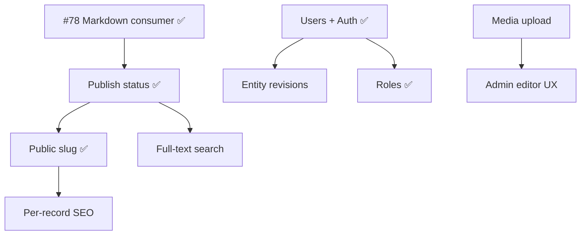

# Milestone: CMS Mid-Term (2026-06 — 2026-08)

Goal: NeNe Records を **小規模 headless CMS** として日常運用できる水準まで引き上げる。WordPress 互換は目指さず、API first・型安全・MCP 対応を維持する。

---

## M1 完了（2026-05-24）✅

**Usable Blog CMS — Done の定義達成: 1 人がログインしてブログを書き、公開 URL で読める。**

| 領域 | 状態 |
| --- | --- |
| Entity model | entity_types, entities, field_defs, typed value tables |
| Field types | text, int, enum, bool, datetime, relation |
| Admin UI | entity types, field defs, records, tags, relations, site settings、**ログイン** |
| Query / filter | tags, relations, pagination, publish status |
| Public consumer | `/view/{type}/{slug}` detail, Markdown body, bootstrap API, site settings |
| AI / ops | MCP **60+** tools, access log analytics |
| Revisions | site settings のみ（entity records は M2） |
| Auth | ✅ JWT Bearer 実装済み — Admin login, protected mutating endpoints (#86) |
| Publish workflow | ✅ draft / published / archived + published_at (#84) |
| CI | ✅ Backend CI + Frontend CI — GitHub Actions 稼働中 (#90) |
| OSS 準備 | ✅ CHANGELOG / SECURITY / llms.txt / smithery.yaml / README バッジ (#94-98) |

---

## M2 完了 ✅

| Issue | PR | Summary |
| --- | --- | --- |
| — | #106 | entity type 削除バグ修正 |
| — | #107 | entity archive + CSV ダウンロード |
| #108 | #111 | admin / editor ロール + capability チェック |
| #113 | #114 | PHP/TypeScript 命名規則ドキュメント + 全ファイル整合 |
| #109 | #115 | Admin i18n 基盤（6 言語メッセージカタログ・`t()`・locale 切替） |
| #110 | #116 | Admin 全画面 i18n 移行（ハードコード排除） |
| #117 | #118 | エンティティレコード変更履歴（revisions） |
| #119 | #120 | Per-record SEO フィールド（meta_title / meta_description） |
| #121 | #122 | 画像フィールド + メディアアップロード API |
| #124 | #123 | Markdown フィールド型 + 管理 UI プレビューエディタ |
| #125 | #124 | ナビゲーション設定 CRUD API とフロントエンド管理画面 |

---

## CMS 機能ギャップ一覧（M2/M3 対象）

WordPress の Settings / Posts / Media / Users / Appearance に相当する不足を、NeNe Records のレイヤー分離に沿って整理する。

### 1. コンテンツ体験（Editor / Presentation）

| # | 機能 | 説明 | 優先度 | 状態 |
| --- | --- | --- | --- | --- |
| E1 | Consumer Markdown レンダリング | 公開 detail の body / footer を Markdown → HTML | P0 | ✅ #78 |
| E2 | Admin コンテンツエディタ | record 編集で Markdown プレビュー付き textarea | P1 | M2 |
| E3 | Per-record 公開 slug | `/view/{type}/{slug}` — 固定 id URL から脱却 | P1 | ✅ #87 |
| E4 | Per-record SEO | meta title / description / OG（site 既定 + record 上書き） | P1 | M2 |
| E5 | 公開プレビュー | draft / 未公開 record の token 付きプレビュー URL | P2 | M3 |

### 2. 公開ワークフロー（Publish）

| # | 機能 | 説明 | 優先度 | 状態 |
| --- | --- | --- | --- | --- |
| P1 | 公開ステータス | draft / published / archived | P0 | ✅ #84 |
| P2 | 公開日時 | `published_at`、一覧 sort/filter | P1 | ✅ #84 |
| P3 | 予約公開 | `scheduled_at` + cron/worker | P3 | M3 |
| P4 | フロントページ設定 | site settings で「トップに出す entity type / record」を指定 | P2 | M2 |
| P5 | ナビゲーション | メニュー定義（手動 URL + entity リンク）、PublicShell 反映 | P2 | M2 |

### 3. 認証・権限（Users / Capabilities）

| # | 機能 | 説明 | 優先度 | 状態 |
| --- | --- | --- | --- | --- |
| A1 | Users テーブル | id, email, password hash, timestamps | P0 | ✅ #86 |
| A2 | ログイン / JWT | Admin SPA + API JWT | P0 | ✅ #86 |
| A3 | Admin API 保護 | 書込系 endpoint に auth middleware | P0 | ✅ #86 |
| A4 | ロール | admin / editor（最小 2 ロール）+ capability check | P1 | ✅ #108 / PR #111 |
| A5 | 編集者記録 | entity / settings 更新時 `updated_by` を JWT から注入 | P1 | M2 |
| A6 | Public read は open | consumer GET は現状維持、書込のみ保護 | P0 | ✅ #86 |

### 4. メディア（Media Library）

| # | 機能 | 説明 | 優先度 | 状態 |
| --- | --- | --- | --- | --- |
| M1 | file / image field type | field_defs 拡張 + assets テーブル | P1 | M2 |
| M2 | Upload API | multipart POST、virus scan / size limit、Problem Details | P1 | M2 |
| M3 | メディア Admin UI | ライブラリ一覧、record への attach | P2 | M2 |
| M4 | ストレージ adapter | local disk → S3 互換（interface 分離） | P3 | M3 |

### 5. 履歴・監査（Revisions / Audit）

| # | 機能 | 説明 | 優先度 | 状態 |
| --- | --- | --- | --- | --- |
| R1 | Entity record revisions | settings と同型（field snapshot or JSON diff） | P1 | M2 |
| R2 | Revision Admin UI | record 詳細で履歴一覧・差分表示・復元 | P2 | M2 |
| R3 | 監査イベント | 設定/公開/削除の structured audit log | P3 | M3 |

### 6. 検索・運用（Search / Ops）

| # | 機能 | 説明 | 優先度 | 状態 |
| --- | --- | --- | --- | --- |
| S1 | Full-text search API | title/body 横断、entity type スコープ | P2 | M3 |
| S2 | Bulk export / import | JSON or CSV、entity type 単位 | P3 | M3 |
| S3 | Webhooks | record published / updated イベント | P3 | M3 |
| S4 | Public cache 方針 | bootstrap + settings の Cache-Control / ETag | P3 | M3 |

### 7. 後回し（Non-mid-term）

- コメント、多言語（i18n）、マルチサイト
- WordPress インポート
- ビジュアルページビルダー

---

## 中期マイルストーン（3 フェーズ）

### M1 — Usable Blog CMS ✅ 完了（2026-05-24）

**Done の定義:** 1 人がログインしてブログを書き、公開 URL で読める。

| 順 | 項目 | Issue | 状態 |
| --- | --- | --- | --- |
| 1 | Consumer Markdown（body + footer） | #78 / PR #79 | ✅ |
| 2 | Publish status + published_at | #84 / PR #85 | ✅ |
| 3 | Users + login + Admin API auth | #86 / PR #88 | ✅ |
| 4 | Public slug routing | #87 / PR #89 | ✅ |
| 5 | Backend CI + OSS 準備 | #90-98 | ✅ |

### M2 — Team-Ready CMS ✅ 完了

**Done の定義:** 2 人以上で役割分担、メディア付き記事、ナビ付き公開サイト。

| 順 | 項目 | Issue | 状態 |
| --- | --- | --- | --- |
| 1 | Roles（admin / editor）+ capability check | #108 / PR #111 | ✅ |
| 2 | Admin i18n 基盤（6 locale メッセージカタログ） | #109 / PR #115 | ✅ |
| 3 | Admin 全画面 i18n 移行 | #110 / PR #116 | ✅ |
| 4 | Entity record revisions | #117 / PR #118 | ✅ |
| 5 | Image / file field + upload API | #121 / PR #122 | ✅ |
| 6 | Per-record SEO fields | #119 / PR #120 | ✅ |
| 7 | Navigation settings | #125 / PR #124 | ✅ |
| 8 | Admin Markdown editor UX | #124 / PR #123 | ✅ |

### M3 — Headless CMS Platform（目標: 2026-08 末）

**Done の定義:** 外部サイト / AI エージェントが検索・Webhook・export で運用可能。

| 順 | 項目 | Issue | PR | 状態 |
| --- | --- | --- | --- | --- |
| 1 | Admin UI リデザイン＋レスポンシブ | #127 | #128 | ✅ マージ済み |
| 2 | Full-text search API | #129 | #131 | ✅ マージ済み |
| 3 | Export API (CSV/JSON) | #130 | #132 | ✅ マージ済み |
| 4 | File field + upload（非画像） | #133 | #134 | ✅ マージ済み |
| 5 | Webhooks | #135 | #136 | 🔄 レビュー中 |
| 6 | Scheduled publish | — | — | 📋 未着手 |
| 7 | Draft preview tokens | — | — | 📋 未着手 |
| 8 | Public cache / performance pass | — | — | 📋 未着手 |

---

## 依存関係（概要）



---

## 検証基準（各 M 共通）

```bash
composer check                    # 229 tests + PHPStan + CS-Fixer + OpenAPI + MCP
npm run check --prefix frontend   # type-check + lint + test + storybook
docker compose exec app vendor/bin/phinx migrate   # 新 migration 後
docker compose exec app php tools/seed-blog-demo.php http://localhost
# Public: http://localhost:5173/view  Admin: http://localhost:5173/
```
