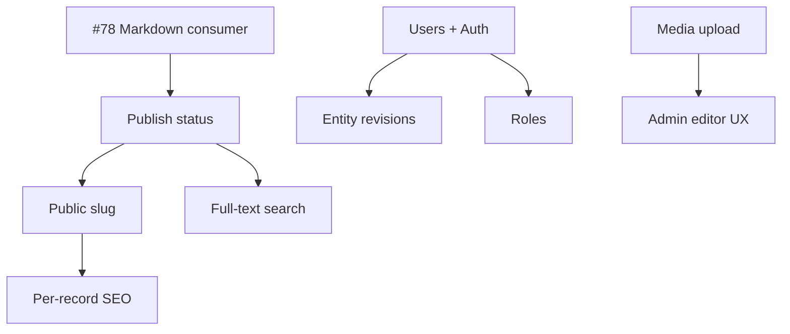

# Milestone: CMS Mid-Term (2026-06 — 2026-08)

Goal: NeNe Records を **小規模 headless CMS** として日常運用できる水準まで引き上げる。WordPress 互換は目指さず、API first・型安全・MCP 対応を維持する。

## 現状ベースライン（2026-05-24 時点）

| 領域 | 状態 |
| --- | --- |
| Entity model | entity_types, entities, field_defs, typed value tables |
| Field types | text, int, enum, bool, datetime, relation |
| Admin UI | entity types, field defs, records, tags, relations, site settings |
| Query / filter | tags, relations, pagination |
| Public consumer | `/view` index / browse / detail, bootstrap API, site settings 反映 |
| AI / ops | MCP 59 tools, access log analytics |
| Revisions | **site settings のみ**（entity records は未対応） |
| Auth | **未実装**（Admin / API は事実上 open） |

参照: Issue #80（Site Settings, merged PR #81）, #78（body Markdown, 未マージ）

---

## CMS 機能ギャップ一覧

WordPress の Settings / Posts / Media / Users / Appearance に相当する不足を、NeNe Records のレイヤー分離に沿って整理する。

### 1. コンテンツ体験（Editor / Presentation）

| # | 機能 | 説明 | 優先度 |
| --- | --- | --- | --- |
| E1 | Consumer Markdown レンダリング | 公開 detail の body / footer を Markdown → HTML（#78） | P0 |
| E2 | Admin コンテンツエディタ | record 編集で Markdown プレビュー付き textarea（将来 WYSIWYG 差替可） | P1 |
| E3 | Per-record 公開 slug | `/view/{type}/{slug}` — 固定 id URL から脱却 | P1 |
| E4 | Per-record SEO | meta title / description / OG（site 既定 + record 上書き） | P1 |
| E5 | 公開プレビュー | draft / 未公開 record の token 付きプレビュー URL | P2 |

### 2. 公開ワークフロー（Publish）

| # | 機能 | 説明 | 優先度 |
| --- | --- | --- | --- |
| P1 | 公開ステータス | draft / published / archived（enum field または first-class 列） | P0 |
| P2 | 公開日時 | `published_at`、一覧 sort/filter | P1 |
| P3 | 予約公開 | `scheduled_at` + cron/worker（後期） | P3 |
| P4 | フロントページ設定 | site settings で「トップに出す entity type / record」を指定 | P2 |
| P5 | ナビゲーション | メニュー定義（手動 URL + entity リンク）、PublicShell 反映 | P2 |

### 3. 認証・権限（Users / Capabilities）

| # | 機能 | 説明 | 優先度 |
| --- | --- | --- | --- |
| A1 | Users テーブル | id, email, display_name, password hash, timestamps | P0 |
| A2 | ログイン / セッション | Admin SPA + API session または JWT（NENE2 パターン） | P0 |
| A3 | Admin API 保護 | 書込系 endpoint に auth middleware | P0 |
| A4 | ロール | admin / editor / viewer（最小 2 ロール） | P1 |
| A5 | 編集者記録 | entity / settings 更新時 `updated_by` を JWT から注入 | P1 |
| A6 | Public read は open | consumer GET は現状維持、書込のみ保護 | P0 |

### 4. メディア（Media Library）

| # | 機能 | 説明 | 優先度 |
| --- | --- | --- | --- |
| M1 | file / image field type | field_defs 拡張 + 値テーブル or 共通 assets テーブル | P1 |
| M2 | Upload API | multipart POST、virus scan / size limit、Problem Details | P1 |
| M3 | メディア Admin UI | ライブラリ一覧、record への attach | P2 |
| M4 | ストレージ adapter | local disk → S3 互換（interface 分離） | P3 |

### 5. 履歴・監査（Revisions / Audit）

| # | 機能 | 説明 | 優先度 |
| --- | --- | --- | --- |
| R1 | Entity record revisions | settings と同型（defs 不要、field snapshot or JSON diff） | P1 |
| R2 | Revision Admin UI | record 詳細で履歴一覧・差分表示・復元 | P2 |
| R3 | 監査イベント | 設定/公開/削除の structured audit log（access log とは別） | P3 |

### 6. 検索・運用（Search / Ops）

| # | 機能 | 説明 | 優先度 |
| --- | --- | --- | --- |
| S1 | Full-text search API | title/body 横断、entity type スコープ | P2 |
| S2 | Bulk export / import | JSON or CSV、entity type 単位 | P3 |
| S3 | Webhooks | record published / updated イベント | P3 |
| S4 | Public cache 方針 | bootstrap + settings の Cache-Control / ETag | P3 |

### 7. 後回し（Non-mid-term）

- コメント、多言語（i18n）、マルチサイト
- WordPress インポート
- ビジュアルページビルダー

---

## 中期マイルストーン（3 フェーズ）

### M1 — Usable Blog CMS（目標: 2026-06 末）

**Done の定義:** 1 人がログインしてブログを書き、公開 URL で読める。

| 順 | 項目 | 想定 Issue テーマ |
| --- | --- | --- |
| 1 | Consumer Markdown（body + footer） | #78 マージ・footer 追随 |
| 2 | Publish status + published_at | `published` enum + API filter + Admin UI |
| 3 | Users + login + Admin API auth | users テーブル、AuthGate 実装、書込 401 |
| 4 | Public slug routing | slug field convention + `/view/{type}/{slug}` |
| 5 | seed-blog-demo 更新 | 公開ステータス・slug・settings 込み |

### M2 — Team-Ready CMS（目標: 2026-07 末）

**Done の定義:** 2 人以上で役割分担、メディア付き記事、ナビ付き公開サイト。

| 順 | 項目 | 想定 Issue テーマ |
| --- | --- | --- |
| 1 | Roles（admin / editor） | capability check on mutating routes |
| 2 | Entity record revisions | API + Admin 履歴タブ |
| 3 | Image / file field + upload API | 最小メディア |
| 4 | Per-record SEO fields | meta override on public bootstrap |
| 5 | Navigation settings | menu defs + PublicShell |
| 6 | Admin Markdown editor UX | preview pane |

### M3 — Headless CMS Platform（目標: 2026-08 末）

**Done の定義:** 外部サイト / AI エージェントが検索・Webhook・export で運用可能。

| 順 | 項目 | 想定 Issue テーマ |
| --- | --- | --- |
| 1 | Full-text search API + MCP tool | |
| 2 | Scheduled publish | worker + status transition |
| 3 | Webhooks | OpenAPI documented |
| 4 | Import / export | entity type bundle |
| 5 | Draft preview tokens | |
| 6 | Public cache / performance pass | list N+1, bootstrap slimming |

---

## 依存関係（概要）



---

## 検証基準（各 M 共通）

```bash
composer check
npm run check --prefix frontend
docker compose exec app vendor/bin/phinx migrate   # 新 migration 後
docker compose exec app php tools/seed-blog-demo.php http://localhost
# Public: http://localhost:5173/view  Admin: http://localhost:5173/
```

---

## Issue 起票候補（次のバッチ）

| 優先 | タイトル案 |
| --- | --- |
| P0 | feat: Users テーブルと Admin ログイン（API auth 最小） |
| P0 | feat: Publish status + published_at（entity 公開ワークフロー） |
| P0 | docs/chore: #78 Markdown マージと footer Markdown 追随 |
| P1 | feat: Public slug routing（/view/{type}/{slug}） |
| P1 | feat: Entity record revisions（settings パターン踏襲） |
| P1 | feat: Image/file field type と upload API |

Tracking issue: #82
